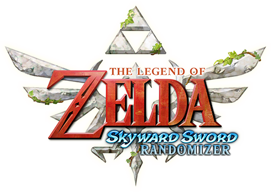
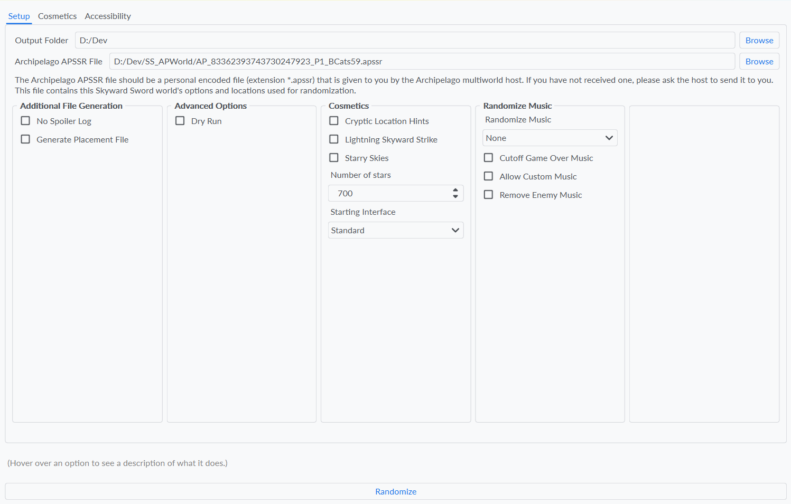

# The Legend of Zelda: Skyward Sword Randomizer Archipelago World Setup

This is the official Archipelago World for Skyward Sword.

From now on, Archipelago may be referred to as "AP". Skyward Sword may be referred to as "SS".



### What you'll Need
- The latest release of [Archipelago](https://github.com/ArchipelagoMW/Archipelago/releases/latest)
- [Dolphin Emulator](https://dolphin-emu.org/download/) (use the dev version!)
- A `The Legend of Zelda: Skyward Sword` unrandomzied US 1.00 iso
- The [Archipelago release of the Skyward Sword Randomizer](https://nightly.link/Battlecats59/sslib/workflows/build.yaml/archipelago)
- The Skyward Sword AP World:
    - This includes the [APWorld file and the YAML options file](https://github.com/Battlecats59/SS_APWorld/releases/latest)
    - A zip file including both of these can be downloaded [here](https://github.com/Battlecats59/SS_APWorld/releases/download/v0.1.0/APSkywardSword.zip)

### Useful Links
- [Archipelago Setup Guide](https://archipelago.gg/tutorial/Archipelago/setup/en)
- [Archipelago Main Discord](https://discord.gg/8Z65BR2)

### Setting up Archipelago
- Open the Archipelago launcher and click the `Install APWorld` button
- Locate your `ss.apworld` file that you downloaded earlier
- After Archipelago installs the world, restart AP
- If running from source, see [Running from Source](#running-from-source)

### Editing your YAML file
- You should have downloaded a YAML file named `Skyward Sword.yaml` with the APWorld.
- Open this file in any text editor
    - [Visual Studio Code](https://code.visualstudio.com/Download) is a good option, it will color-code the text to make it easier to read
    - Any text editor will work, but with simple ones such as notepad, be sure to keep the indentations consistent
- Scroll through the file and set the options to whatever you would like. The integer next to each option will determine the weighting of that option being chosen. If you want to make sure an option is set to a certain value, set the weight to 50 for that value and the weights for other values to 0.
    - Don't hesitate to ask someone from the community for guidance if you are struggling with editing the options yourself.
- After you set your options to your prefered settings, save the YAML file and send it to the world host.

### Joining a Multiworld
- To join a multiworld, edit your YAML file to your desired settings and send the file to the multiworld host. They will use your YAML, along with those of the other players, to generate the multiworld.
- The host should send you a APSSR file named accordingly: `AP_{seed}_P{player id}_{player name}.apssr`. If the title of this file does not fit the template, ask the host if something went wrong. See example below.
- Open the AP release of the Skyward Sword Randomizer. Set your output folder to wherever you would like the randomized iso placed. Set the APSSR file in the randomizer window to the APSSR file that you just received from the host. **MAKE SURE that you put in the correct APSSR file.**
- Set your cosmetic options in the randomizer window and select randomize.
- After randomization, open the randomized iso in Dolphin. Next, see [Setting up your Client](#setting-up-your-client).
    - The randomizer window should look like this:



### Setting up your Client
- After opening the randomized iso in Dolphin, open the `Skyward Sword Client` in Archipelago.
    - Make sure your in game hash (on the top of the file select screen) is the same that the randomizer gave you when you generated the iso. It should be `AP P{player id} {three random words}`.
- Make sure the client hooks to Dolphin, then begin a new file in game.
    - **NOTE: Make sure all 3 files in-game are EMPTY. AP reads locations based on scene flags, so if you are planning on doing the Back in Time glitch (BiT), you must not have any pre-made files or it will screw with AP.**
    - Also, make sure your filename in game is the exact same as your AP name that you set in your YAML.
- Connect to the room in your client by running `/connect {address}`. The link to the room should be given to you by the multiworld host. The address will be in the form of `archipelago.gg:XXXXX`.
- The client will not connect you if you have not started a new file with the same name as what is in your YAML. If you fail to connect, make sure that you have started a new file, you are in Link's room, and your filename is the same as your AP name.
- Wait until everyone is in game and ready before you leave Link's room. See [Playing the Game](#playing-the-game).
- Run `/help` in the client to see all commands.

### Playing the Game
- Once the game is started, you will receive items that other players pick up for you while Link is in a state where he can receive items.
- If you find an item that belongs to someone else, it will appear as a Life Tree Fruit and the game will say that you received an Archipelago item.
- When you beat the game, **MAKE SURE you skip through at least 3 cutscenes at the end of the game.**
    - The third cutscene after Demise, which is right before the staff roll (credits), sets the flag that you beat Demise, which tells AP that you beat the game. **Skipping this cutscene will also set the flag**. Just make sure that you get to the staff roll so the other players can receive any items that are still in your world.

### Generating a multiworld
For information on generating an AP world, visit the [Archipelago Setup Guide](https://archipelago.gg/tutorial/Archipelago/setup/en#generating-a-multiplayer-game).

### Running from Source
Archipelago requires python 3.10.11 or newer (not the Windows Store version) and Git
1. Clone the SSArchipelago repository:
```
git clone https://github.com/Battlecats59/SSArchipelago
cd SSArchipelago
```
2. Checkout the `ss` branch
```
git checkout ss
```
3. Install dependencies
```
py ModuleUpdate.py
```
4. Run the launcher. The Skyward Sword world is already installed.
```
py Launcher.py
```
5. Additional Python Scripts (comments begin with #)
```
py Generate.py     # Generates a multiworld with the YAMLs in the /Players/ folder
py MultiServer.py  # Hosts the multiworld locally, using the generated MW file as a param
py WebHost.py      # Hosts the Archipelago website locally
```

Refer to the following AP guides for more information on running from source.
- [Running from source on Windows](https://github.com/ArchipelagoMW/Archipelago/blob/main/docs/running%20from%20source.md)
- [Running from source on macOS](https://github.com/ArchipelagoMW/Archipelago/blob/main/worlds/generic/docs/mac_en.md)

### Discord
Discussion regarding this APWorld is in the [Archipelago Main Discord](https://discord.gg/8Z65BR2), in the Skyward Sword thread under the `future-game-design` channel.

- [Skyward Sword Randomizer Discord](https://discord.gg/evpNKkaaw6)
- [Skyward Sword HD Randomizer Discord](https://discord.gg/nNbpfH5jyG)
- [Skyward Sword Randomizer Racing Discord](https://discord.gg/cWE892y8WB)

### Credits

- **Battlecats59**: Archipelago implementation
- **lepelog**: SS Rando creator, arc work for multiworld
- **SS Rando Devs**: Creating this lovely randomizer
- Testers will go here too


